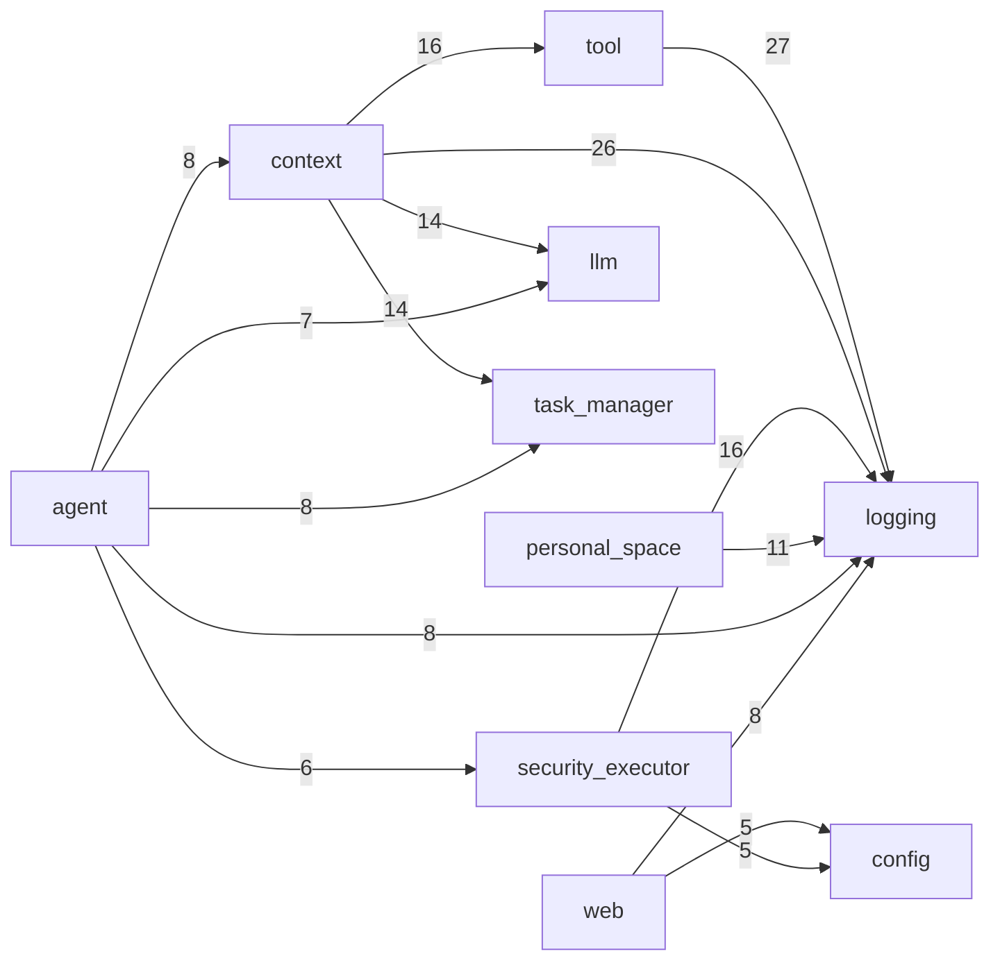

# PyClaego

**中心化 Agent 管理系统 - WebSocket 架构的智能对话平台**

[](https://www.python.org/)
[](LICENSE)

---

## 🚀 快速开始

### 初始化环境

```bash
cd pyclaego
uv sync
```

### 启动 Core 服务器

```bash
# 使用启动脚本（推荐）
./scripts/start_core.sh

# 或直接运行
uv run pyclaego-core

# 或通过 Python 入口脚本
uv run python core_server.py
```

---

## 📖 项目概述

PyClaego 是一个**中心化 Agent 管理系统**，采用 **WebSocket** 通信架构，支持**多用户实时协作**。系统围绕 **PersonalSpace / Widget** 模型构建：一个 PersonalSpace 是用户的工作台，内部承载多个配置可层叠的 Widget；每个 Widget 是一个完整的 Agent 运行时，拥有独立的上下文、存储、Hook 与定时任务，灵活支持多种 **Agent 策略**和 **LLM 后端**。

### 🎯 核心特性

- ✅ **实时消息广播** - 同一 Session 的所有用户实时接收消息（WebSocket fire-and-forget）
- ✅ **Session 隔离** - 独立工作空间、独立消息历史，支持按 session_id 自定义工作目录
- ✅ **Agent 策略可配置** - 内置 `Echo`/`Simple`/`Spawn` 三种主 Agent，`Spawn` 支持并发子 Agent 调度
- ✅ **子 Agent 体系** - 内置 `EchoSubAgent`/`InfoGathererSubAgent`/`CodeExplorerSubAgent`，支持继承或独立上下文
- ✅ **多 LLM 后端** - 支持 OpenAI 兼容 API、Anthropic Claude、Google Gemini
- ✅ **持久化存储** - Session 历史支持 `history.json` / `history.jsonl` 双格式，自动检测优先 jsonl
- ✅ **异步架构** - 基于 Python asyncio，消息队列串行处理，TaskManager 集中调度
- ✅ **丰富工具系统** - 内置工具：Bash、Python 执行、文件读写编辑、目录/Glob、文本搜索、WebFetch/Search（含 V2/V3）、PDF/图片读取、下载、用户确认（`query_user`）等
- ✅ **多层安全审查** - LLM Bash 智能审查、密钥外泄检测、出网控制、文件大小、Workspace 路径、子 Agent 深度、调用环路、速率限制、成本预算、QUERY 用户确认等 12 种内置规则
- ✅ **智能上下文管理** - `simple_v2`/`window_v2`/`soul_v5`/`soul_v6`/`kbase_mcp` 多策略；V5/V6 提供 MD+SQLite 长期记忆与自动召回
- ✅ **记忆工具集** - SoulV5/V6 提供 9 个记忆工具（query / save_case / save_experience / browse_topics / read / update / deprecate / preferences / tool_result_read）
- ✅ **技能系统 (Skill)** - 全局多目录加载 + Session 独有技能，按优先级覆盖
- ✅ **路径占位符解析与脱敏** - 工具入参支持 `{{WORKSPACE}}`/`{{PROJECT}}`/`{{TEMP}}`/`{{SKILL:name}}`/`{{SESSION_SKILL_ROOT}}`，工具输出真实路径自动反向脱敏
- ✅ **TaskManager 任务跟踪** - 父子任务树、状态机（PENDING/RUNNING/COMPLETED/FAILED/CANCELLED）、订阅推送
- ✅ **Web UI** - 内置 FastAPI Web 服务器，提供 `/chat`（兼容）、`/ws/v2/chat`（PS 协议）、`/api/v2/*`（PS/Widget CRUD）、`/tasks`、`/tasks3`（任务图谱+工件懒加载）、`/dashboard`（React SPA）、`/api/logs/*`（日志 REST + WS）
- ✅ **双日志系统** - `LogManager`（标准 logging + 文件轮转）+ `RunningLog`（按 name+日期分文件的业务流水）
- ✅ **LLM/工具调用日志** - 每次 LLM 调用与工具调用完整结构化保存为 JSON

## 🧭 当前整体设计（基于模块依赖分析）

> 分析范围：`pyclaego/src/**/*.py`，覆盖头部 import 与函数内 import。

### 关键规模指标

- 源文件总数：**221**
- 跨包依赖边（文件级去重）：**51**
- 加权边总数（文件计数之和）：**260+**

### 分层设计（从底到顶）

1. **基础设施层**：`config`、`logging`
2. **能力层**：`llm`、`tool`、`skill`、`task_manager`、`message`
3. **安全与上下文层**：`security_executor`、`context`
4. **智能体与工作台层**：`agent`、`personal_space`
5. **服务接入层**：`core`、`web`

该分层体现了典型的“底层通用能力 → 上层编排与接入”模式：
- `logging` 与 `config` 为全局基座；
- `tool`/`llm`/`task_manager` 提供可复用执行能力；
- `context` 负责消息与记忆组织，`agent` 负责推理与工具循环；
- `personal_space` 统一工作台生命周期；
- `core` 与 `web` 暴露对外调度与接口。

### 包级依赖关系（Top）



### 核心枢纽模块

- **被依赖最多（In-Degree）**：`logging`（108）、`task_manager`（29）、`llm`（26）、`tool`（23）、`config`（21）
- **依赖最广（Out-Degree）**：`context`（77）、`agent`（37）、`security_executor`（30）、`tool`（30）、`personal_space`（23）

这说明当前系统以 `logging/config` 为底座，以 `context/agent/security_executor` 为核心编排区，以 `web/personal_space/core` 作为对外交互与调度出口。

---

## 🧬 PersonalSpace 架构（最新主线）

新版后端围绕 **PersonalSpace（PS）** 模型重构，取代了旧的 `session` 概念。一个 PS 是一个用户的"工作台"，
内部承载多个独立但配置可层叠的 **Widget**。每个 Widget 是一个完整的运行时（Agent + Context + 可选 Store/Tools/Hook/Cron），
按 `WidgetClass` 模板初始化，按 `widget.config.json` 个性化覆盖。

### 关键概念

| 概念 | 作用 | 代码位置 |
|---|---|---|
| `PersonalSpace` | 用户工作台运行时；持有 widgets、连接计数、in-flight tasks、配置热重载 | [src/pyclaego/personal_space/personal_space.py](src/pyclaego/personal_space/personal_space.py) |
| `PersonalSpaceManager` | 进程级单例，LRU 卸载，按 `ps_id` 懒加载 | [src/pyclaego/personal_space/manager.py](src/pyclaego/personal_space/manager.py) |
| `Widget` | 单个运行时（agent/context/store/tools/hook） | [src/pyclaego/personal_space/widget.py](src/pyclaego/personal_space/widget.py) |
| `WidgetClass` | 模板：JSON defaults + 可选 `config_schema` + 可选 `widget_class.py` hook | [src/pyclaego/personal_space/widget_classes/](src/pyclaego/personal_space/widget_classes/) |
| `WidgetStore` | per-widget 持久化（sqlite / jsonl） | [src/pyclaego/personal_space/datastores/](src/pyclaego/personal_space/datastores/) |
| `WidgetCronScheduler` | APScheduler 包装，按 widget.json 中的 `cron[]` 触发 | [src/pyclaego/personal_space/cron/](src/pyclaego/personal_space/cron/) |
| `PSGateway` | WebSocket 路由：`open / chat / close` 协议；同时给 cron 复用 | [src/pyclaego/core/ps_gateway.py](src/pyclaego/core/ps_gateway.py) |
| `TaskBelonging` | `(ps_id, widget_id?, subagent_id?)` 三元组，绑定到 Task/Event/Handler | [src/pyclaego/task_manager/belonging.py](src/pyclaego/task_manager/belonging.py) |

### 磁盘布局

```
~/pyclaego/personal_spaces/<ps_id>/
├── personal_space.json          # PSManifest（title / widget_order / ...）
├── personal_space.config.json   # PS 级配置（参与 deep_merge）
└── widgets/<widget_id>/
    ├── widget.json              # WidgetManifest（widget_class、cron[]、viewers[]）
    ├── widget.config.json       # widget 级配置覆盖
    └── store.db / *.jsonl       # WidgetStore 持久化
```

`WidgetClass` 模板独立于用户数据：

```
pyclaego/src/pyclaego/personal_space/widget_classes/widgets/<class_id>/  # builtin（如 chat、notes）
~/pyclaego/widget_classes/<class_id>/    # 用户自定义（覆盖同名 builtin）
├── widget_class.json            # defaults / config_schema / *_file 引用
├── widget_class.py              # 可选 WidgetHook 子类
├── schema.sql / prompts/        # 资源文件
└── viewers.json / cron.json     # 默认 viewers / cron
```

### 配置层叠

`PersonalSpaceConfigManager` 按以下顺序 deep-merge：

```
全局 YAML  ←  PS 级 JSON  ←  WidgetClass defaults  ←  widget.config.json
```

dict 递归合并、list 原子替换；JSON 支持 `{"!concat": [...]}` / `{"!env": "VAR"}` 等标签；`watchfiles` 监听全部 PS 目录，配置变更即时通知，已加载 widget 缓存自动失效。

### 请求路径

```
浏览器 / TUI ──ws──▶  CoreScheduler.handle_inbound
                       │
                       ▼
                    PSGateway   (open / chat / close)
                       │
                       ├─▶ PSManager.get(ps_id)
                       │     └─▶ PersonalSpace.load() (LRU 控制)
                       ├─▶ PS.get_widget(wid)
                       │     └─▶ Widget.load() (Agent / Context / Hook.on_create)
                       └─▶ Widget.process_message(...)
                             ├─▶ Agent.process_v2 → Tools (含 widget_db_*, widget_emit)
                             ├─▶ Hook.on_chat / on_cron
                             └─▶ TaskHandler 跟踪进度
```

`WidgetCronScheduler` 通过同一个 `gateway.handle_inbound` 入口（虚拟 `conn_id="cron:..."`）触发 `chat` 消息，
不重复实现任何路由逻辑。

### Web/UI 接入

- REST：`/api/v2/widget_classes`、`/api/v2/personal_spaces/{ps_id}`、`/api/v2/personal_spaces/{ps_id}/widgets/...`、`.../highlight`
- WS：`/ws/v2/chat` —— `open / chat / close` 协议透传到 CoreScheduler
- 前端：`pyclaego/dashboard/`（React + Vite + RJSF + react-router）。`/dashboard` 路由自动挂载构建产物 `dist/`
- 老的 `/chat/{session_id}` 与 `/api/sessions` 仍兼容存在，方便逐步迁移

### 测试矩阵

| 文件 | 覆盖范围 | 数量 |
|---|---|---|
| `tests/test_task_belonging.py` | `TaskBelonging`、key、derive_for_subagent | 18 |
| `tests/test_config_v2.py` | deep_merge、JSON 标签、PSConfigManager | 20 |
| `tests/test_personal_space.py` | PSManager LRU / 连接计数 / bootstrap | 18 |
| `tests/test_widget_runtime.py` | Widget 生命周期 + lock + process_message | 18 |
| `tests/test_ps_gateway.py` | open / chat / close / 错误路径 | 12 |
| `tests/test_widget_store.py` + `tests/test_widget_tools.py` | sqlite/jsonl + db 工具 + emit | 25 |
| `tests/test_widget_class_full.py` | spec extensions + notes class + Hook 发现 / 生命周期 | 12 |
| `tests/test_widget_cron.py` | trigger 解析 / 模板渲染 / scan_and_register / fire | 7 |
| `tests/test_ps_api.py` | `/api/v2/*` 全部 endpoints | 12 |
| **合计** | | **143** |

```bash
cd pyclaego
python -m pytest tests/test_task_belonging.py tests/test_config_v2.py \
    tests/test_personal_space.py tests/test_widget_runtime.py tests/test_ps_gateway.py \
    tests/test_widget_store.py tests/test_widget_tools.py \
    tests/test_widget_class_full.py tests/test_widget_cron.py tests/test_ps_api.py -q
```

各模块的细节见各自 `README.md`。

---

## 🏗️ 系统架构

### 总体架构图

```
┌─────────────────────────────────────────────────────────────┐
│                         用户层                               │
│  ┌──────────┐  ┌──────────┐  ┌──────────┐                 │
│  │ TUI      │  │ TUI      │  │ TUI      │  ...            │
│  │ Alice    │  │ Bob      │  │ Charlie  │                 │
│  └────┬─────┘  └────┬─────┘  └────┬─────┘                 │
│       │             │              │                        │
│       └─────────────┴──────────────┘                       │
│                     │ WebSocket                             │
└─────────────────────┼───────────────────────────────────────┘
                      │
┌─────────────────────┼───────────────────────────────────────┐
│                     ▼         Core Server                    │
│            ┌─────────────────┐                              │
│            │  CoreScheduler  │                              │
│            │  - WebSocket    │                              │
│            │  - 消息路由      │                              │
│            │  - 广播管理      │                              │
│            └────────┬────────┘                              │
│                     │                                        │
│            ┌────────┴────────┐                              │
│            │ PSGateway       │                              │
│            │ - open/chat/    │                              │
│            │   close 路由    │                              │
│            └────────┬────────┘                              │
│                     │                                        │
│            ┌────────┴────────┐                              │
│            │  PSManager      │                              │
│            │  - PS 懒加载    │                              │
│            │  - LRU 卸载     │                              │
│            └────────┬────────┘                              │
│                     │                                        │
│     ┌───────────────┼───────────────┐                      │
│     │               │               │                       │
│  ┌──▼───┐      ┌───▼────┐     ┌───▼────┐                 │
│  │  PS  │      │  PS    │     │  PS    │  ...            │
│  │  001 │      │  002   │     │  003   │                 │
│  └──┬───┘      └───┬────┘     └───┬────┘                 │
│     │              │               │                       │
│  ┌──▼───────────────────────────┐                         │
│  │  Widget + SecurityHandler    │                         │
│  │  ├─ SecurityMonitor          │                         │
│  │  │   ├─ LlmBashReviewRule    │ ← LLM 智能审查          │
│  │  │   ├─ WorkspacePathRule    │                         │
│  │  │   ├─ NetworkEgressRule    │                         │
│  │  │   ├─ SecretEgressRule     │                         │
│  │  │   ├─ SubagentDepthRule    │                         │
│  │  │   ├─ ToolCallLoopDetector │                         │
│  │  │   ├─ RateLimit/CostBudget │                         │
│  │  │   └─ QueryUserRule        │ ← 用户确认拦截          │
│  │  ├─ SkillManager (全局+PS)  │                         │
│  │  └─ LLM 调用/工具调用记录    │                         │
│  └──┬──────────────────────────┘                         │
│     │                                                      │
│  ┌──▼───────┐  ┌──────────┐  ┌───────────────┐           │
│  │ Agent    │  │ Context  │  │  ToolManager  │           │
│  │ Echo     │  │ Handler  │  │  20+ tools:   │           │
│  │ Simple   │  │ Simple   │  │  Bash/Python  │           │
│  │ Spawn    │  │ Window   │  │  File R/W/Edit│           │
│  │ +SubAgent│  │ SoulV5/V6│  │  Glob/Search  │           │
│  └──────────┘  │ KbaseMCP │  │  Web/PDF/Img  │           │
│                └──────────┘  └───────────────┘           │
│                                                            │
│  ┌──────────────────────────────────────────────┐         │
│  │ TaskManager  │  Web (FastAPI) │ Memory Tools │         │
│  └──────────────────────────────────────────────┘         │
└─────────────────────┬──────────────────────────────────────┘
                      │
            ┌────────▼─────────┐
            │   LLM Services   │
            │ - OpenAI         │
            │ - Anthropic      │
            │ - Google Gemini  │
            └──────────────────┘
```

### 三层架构

1. **通信层** (Communication Layer)
   - TUI Client: 基于 Textual 的用户界面，通过 WebSocket 连接服务器
   - Core Server: WebSocket 服务器，负责消息路由和广播（fire-and-forget 模式，避免阻塞）

2. **业务层** (Business Layer)
   - PSGateway: `open / chat / close` WebSocket 消息路由，cron 入口复用
   - PersonalSpaceManager: 工作台懒加载 + LRU 卸载
   - PersonalSpace / Widget: 工作台与独立运行时（Agent + Context + Store + Hook + Cron）
   - Agent: 智能处理逻辑（Echo / Simple / Spawn）
   - Security Handler: 单例模式，统一的安全审查 + 路径解析 + 工具调用代理
   - Context Handler: 上下文管理（SimpleV2 / WindowV2 / SoulV5 / SoulV6 / KbaseMCP）
   - Skill Manager: 单例，管理全局技能 + Widget 独有技能

3. **服务层** (Service Layer)
   - LLM Client: LLM API 调用封装（OpenAI + Anthropic）
   - Tool Manager: 工具管理和执行
   - Config Manager: 配置管理，支持环境变量、引用、路径展开
   - LogManager: 标准 Python logging，支持文件轮转和 JSON 格式
   - RunningLog: 业务流水日志，按 name + 日期分文件追加写入

---

## 🚀 快速开始

### 1. 安装依赖

```bash
cd pyclaego
pip install -e ".[tui]"
```

**主要依赖包**（详见 [pyproject.toml](pyproject.toml)）：
- `websockets` · `fastapi` · `uvicorn` — 服务器与 WebSocket
- `textual` — TUI 界面（可选，`.[tui]` 额外依赖）
- `openai` · `anthropic` · `google-genai` — 三个 LLM 客户端
- `tiktoken` · `jieba` — token 计数与中文分词
- `PyYAML` · `python-frontmatter` — 配置与 SKILL/记忆文件解析
- `aiohttp` · `httpx` · `beautifulsoup4` — 网页抓取 / HTTP
- `apscheduler` · `filelock` — 定时任务与文件锁

### 2. 配置文件

创建配置文件（推荐放在 `~/pyclaego/config.yaml`）：

```bash
# 复制示例配置
cp pyclaego/config.example.yaml ~/pyclaego/config.yaml

# 编辑配置（添加 API Key）
vim ~/pyclaego/config.yaml
```

**关键配置项**：

```yaml
# LLM 配置
llm:
  default_provider: "wq_gpt"
  providers:
    wq_gpt:
      api: "openai"                  # 类型: openai 或 anthropic
      api_key: ${WQ_GROUP_API_KEY:}
      base_url: "https://your-api.com/v1"
      model: "gpt-4"
      max_context_tokens: 180000

    kimi_code:
      api: "anthropic"               # Anthropic 兼容接口
      api_key: ${KIMI_CODE_API_KEY:}
      base_url: "https://api.kimi.com/coding"
      model: "k2p5"
      max_tokens: 8192

# Agent 配置
agent:
  type: "simple"                  # echo, simple, spawn
  llm: "@{llm.default_provider}"
  use_tools: true
  simple:
    max_tool_rounds: 55           # 最大工具循环轮次
  spawn:
    max_tool_rounds: 55
    max_concurrent_subagents: 5   # > 0 时 AgentFactory 自动启用 SpawnAgent

# Context 配置
context:
  type: "soul_v5"                 # simple_v2, window_v2, soul_v5, soul_v6, kbase_mcp
  soul_v5:
    keep_groups: 10               # 保留最近 N 个对话 group

context_global:
  soul_v5_memory:
    md_root: !join_path ["@{pyclaego.root_path}", ".memory", "soul_v5"]
    llm_id: "@{llm.default_provider}"
    token_budget:
      context_window_cap: 65536
    memory_recall:
      enabled: true               # 每轮自动检索记忆注入上下文
```

### 3. 启动服务

#### 方式一：使用 CLI 入口（推荐，安装后可用）

```bash
# 启动 Core 服务器
pyclaego-core

# 在另一个终端启动 TUI（PersonalSpace 协议）
pyclaego-tui               # 默认 PS=default, widget=w_chat_default
pyclaego-tui -p my_space   # 指定 ps_id
# 或极简 PS TUI
pyclaego-tui-ps

# 单独启动 Web 服务器（与 core 分进程）
pyclaego-web
```

#### 方式二：直接运行脚本（开发调试）

**终端 1 - 启动 Core 服务器：**
```bash
cd pyclaego
python core_server.py
```

**终端 2 - 启动 TUI 客户端：**
```bash
cd pyclaego
python tui_client.py
# 或 PS TUI
python tui_ps.py
```

#### 方式三：使用便捷脚本

```bash
# 启动 Core 服务器
./scripts/start_core.sh

# 在另一个终端启动 TUI 客户端
./scripts/start_tui.sh
```

### 4. 使用说明

- 在 TUI 输入框中输入消息，按 **Enter** 发送
- TUI 会显示 Agent 响应和**实时进度更新**
- 输入 `/stop`（通过 control 帧发送）停止当前 Agent 执行并清空队列
- 输入 `/help` 查看所有可用命令
- 输入 `/compress` 手动触发上下文压缩（SoulV5/V6）
- 输入 `/llm <provider_id>` 运行时切换 LLM
- **TUI** 按 `Ctrl+C` 或 `Ctrl+D` 退出（不影响 Core）
- **Core** 按 `Ctrl+C` 停止服务器

#### 实时进度推送

系统支持在 Agent 执行过程中实时推送进度消息：

```json
{
  "type": "progress_update",
  "session_id": "sess_xxx",
  "content": "正在调用 LLM...",
  "metadata": {
    "step": "calling_llm",
    "loop_index": 2
  },
  "timestamp": "2026-03-30T19:30:00"
}
```

**进度消息 step 类型**：
- `context_ready` - 上下文准备完成
- `loop_start` - 开始新一轮循环
- `calling_llm` - 正在调用 LLM
- `llm_done` - LLM 响应已接收
- `tool_parsing` - 解析工具调用
- `tools_done` - 工具执行完成
- `finished` - 任务完成

---

## 📁 项目结构

```
pyclaego/
├── config.example.yaml          # 配置文件示例（含完整注释，支持 !include 拆分）
├── core_server.py               # Core 服务器启动脚本（兼容旧入口）
├── web_server.py                # Web/FastAPI 服务器启动脚本（兼容旧入口）
├── tui_client.py                # TUI 客户端启动脚本（兼容旧入口）
├── tui_ps.py                    # PS TUI 客户端启动脚本（兼容旧入口）
├── feishu_gateway.py            # 飞书网关（实验性）
├── skills/                      # 本地全局技能目录
├── widget_classes/              # 用户自定义 WidgetClass 目录（覆盖同名 builtin）
│
├── src/
│   └── pyclaego/                # Python 包根
│       ├── cli/                 # Console Script 入口（pyproject.toml scripts）
│       │   ├── core.py          # pyclaego-core → CoreScheduler
│       │   ├── web.py           # pyclaego-web  → FastAPI/Uvicorn
│       │   ├── tui.py           # pyclaego-tui  → TUIClient（PS 协议）
│       │   ├── tui_ps.py        # pyclaego-tui-ps → PSChatTUI
│       │   └── feishu.py        # pyclaego-feishu → FeishuGateway
│       │
│       ├── agent/               # Agent 模块
│       │   ├── base_agent.py    # BaseAgent 抽象基类
│       │   ├── echo_agent.py    # EchoAgent
│       │   ├── simple_agent.py  # SimpleAgent
│       │   ├── spawn_agent.py   # SpawnAgent（含子 Agent 调度）
│       │   ├── agent_factory.py # Agent 工厂
│       │   └── subagent/        # 子 Agent 实现
│       │       ├── base_subagent.py
│       │       ├── echo_subagent.py
│       │       ├── info_gatherer_subagent.py
│       │       └── code_explorer_subagent.py
│       │
│       ├── context/             # 上下文管理
│       │   ├── base_context.py      # V1/V2/V3 基类接口
│       │   ├── simple_context_v2.py # SimpleContextHandlerV2
│       │   ├── window_context_v2.py # WindowContextHandlerV2（echo 专用）
│       │   ├── soulv5_*.py          # SoulV5 上下文 + MD/SQLite 记忆管理器/召回器
│       │   ├── soulv6_*.py          # SoulV6（V5 升级：TurnBrief / OpenLoops / WriteReview 等）
│       │   ├── mcp_context/         # KbaseMCPContext（md_kbase MCP 外接）
│       │   ├── history_manager.py   # 历史文件管理 (json/jsonl)
│       │   ├── token_counter.py     # tiktoken 计数
│       │   ├── context_factory.py   # 上下文工厂
│       │   ├── system_prompts/      # 内置系统提示词模板
│       │   ├── memory_tools/        # SoulV5/V6 记忆工具集
│       │   ├── agent_tools/         # Agent 工具 (spawn_subagent)
│       │   └── subagent/            # 子 Agent 上下文处理
│       │
│       ├── personal_space/      # PersonalSpace / Widget 运行时（当前主线）
│       │   ├── personal_space.py    # PersonalSpace 运行时
│       │   ├── manager.py           # PersonalSpaceManager 单例 + LRU
│       │   ├── widget.py            # Widget 运行时
│       │   ├── models.py            # PSManifest / WidgetManifest
│       │   ├── view_schema.py       # ViewSchema（dashboard 视图）
│       │   ├── widget_classes/      # WidgetClassRegistry / Spec / Hook 基类 + builtin
│       │   │   └── widgets/
│       │   │       ├── chat/        # builtin chat widget
│       │   │       └── notes/       # builtin notes widget
│       │   ├── datastores/          # WidgetStore：SqliteStore / JsonlStore
│       │   ├── widget_tools/        # widget_db_query / widget_db_write / widget_emit
│       │   └── cron/                # WidgetCronScheduler / trigger / render_prompt
│       │
│       ├── tool/                # 全局工具系统
│       │   ├── base_tool.py         # BaseTool / ToolResult / ToolStatus
│       │   ├── tool_call_parser.py  # XML 工具调用解析器（兜底）
│       │   ├── tool_manager.py      # ToolManager 单例
│       │   ├── safe_bash/           # safe_bash 沙箱实现
│       │   ├── safe_python/         # safe_python 沙箱（受限 exec 环境）
│       │   ├── file_system/         # 文件系统工具（read/write/edit/glob/find_line/search_text/…）
│       │   └── tools/               # 网络类工具（bash / python_exec / web_fetch[_v2/_v3] /
│       │                            #   web_search / download_file / query_user …）
│       │
│       ├── security_executor/   # 安全审查系统
│       │   ├── handler.py           # SecurityHandler 单例
│       │   ├── monitor.py           # SecurityMonitor
│       │   ├── auditor.py           # 审计记录
│       │   ├── rule_factory.py      # 规则工厂
│       │   └── rules/               # llm_bash / workspace_path / file_size / network_egress /
│       │                            #   secret_egress / subagent_depth / tool_call_loop_detector /
│       │                            #   rate_limit / cost_budget 等规则
│       │
│       ├── skill/               # 技能系统
│       │   ├── skill.py             # Skill 类（SKILL.md 解析、懒加载）
│       │   ├── manager.py           # SkillManager（全局 + Widget 独有，优先级排序）
│       │   └── parser.py
│       │
│       ├── core/                # 核心调度
│       │   ├── scheduler.py         # CoreScheduler（WebSocket 服务器 + 广播）
│       │   └── ps_gateway.py        # PSGateway（open / chat / close 路由）
│       │
│       ├── web/                 # Web/FastAPI 接入层
│       │   ├── app.py               # FastAPI 应用
│       │   ├── ps_api.py            # /api/v2/* REST（PersonalSpace / Widget CRUD）
│       │   ├── ps_websocket.py      # /ws/v2/chat WebSocket 代理
│       │   ├── task_api.py          # /api/tasks REST + Artifact 查询
│       │   ├── task_websocket.py    # /ws/tasks WebSocket
│       │   ├── task_bridge.py       # CoreScheduler 与 Web 进程间桥接
│       │   ├── logs_api.py          # /api/logs/* 日志树/文件 REST + WS 实时流
│       │   ├── websocket.py         # 旧 /chat/{session_id} 兼容路由
│       │   └── static/              # 前端静态资源（旧版聊天 + 任务监控页 + tasks3）
│       │
│       ├── task_manager/        # TaskManager 任务父子树 / TaskBelonging / ArtifactStore / TextSubscriber
│       │   ├── belonging.py         # TaskBelonging 三元组（ps_id / widget_id / subagent_id）
│       │   ├── artifact_store.py    # TaskArtifactStore（任务工件持久化）+ ArtifactReporter
│       │   └── handler.py           # WidgetTaskHandler / SessionTaskHandlerV2
│       ├── note_system/         # 笔记系统（NoteVault：BDX/Markdown 文档、SQLite 全文检索）
│       │   ├── vault.py             # NoteVault（文档增删改查 + SQLite FTS5）
│       │   ├── manager.py           # NoteSystemManager（进程级引用计数注册表）
│       │   ├── bdx_parser.py        # Tiptap BDX JSON 解析器
│       │   └── rpc/                 # Widget RPC 方法（view/query/insert/update/delete）
│       ├── llm_router/          # LLM 路由代理（多上游负载均衡 + 用量统计）
│       │   ├── app.py               # FastAPI 应用（反向代理 + 日志中间件）
│       │   ├── routing.py           # RouteTable（加权随机/失败切换）
│       │   └── recording/           # SQLite 用量记录（tokens / 成本）
│       ├── command/             # 服务端 slash 命令路由器
│       │   └── dispatcher.py        # CommandDispatcher（/stop / /llm / /compress 等）
│       ├── message/             # TUI 客户端与网关消息协议
│       ├── utility/             # 通用工具（validate_session_id 等）
│       │
│       ├── llm/                 # LLM 客户端
│       │   ├── base.py              # LLMClient 抽象基类（chat_completion_v2）
│       │   ├── openai_client.py     # OpenAIClient
│       │   ├── anthropic_client.py  # AnthropicClient
│       │   ├── gemini_client.py     # GeminiClient
│       │   ├── types.py             # UnifiedMessage / ContentPart / ChatResponseV2
│       │   └── factory.py           # LLMClientFactory（api 参数驱动）
│       │
│       ├── config/              # 配置管理
│       │   └── manager.py           # ConfigManager（环境变量/引用/路径/!include）
│       │
│       └── logging/             # 日志系统
│           ├── log_manager.py       # LogManager（单例、轮转、text/json）
│           └── running_log.py       # RunningLog（业务流水）
│
├── dashboard/                   # React + Vite 前端（构建产物挂载到 /dashboard）
│   └── src/
│       ├── pages/               # Dashboard / Tasks2Page / NotesPage 等
│       └── components/          # 通用组件
│
├── .logs/                       # 运行日志目录（自动生成，log_root 可配置）
├── docs/                        # 历史设计文档按日期分组
└── tests/                       # 测试套件
```

---

## 🧩 核心模块

### 1. Agent 系统

**支持的 Agent 类型**：

| Agent 类型 | 描述 | 适用场景 |
|-----------|------|---------|
| **EchoAgent** | 单次 LLM 调用（无工具循环） | 快速问答、最小链路 |
| **SimpleAgent** | 工具循环执行主流程，支持多轮 tool call | 常规工具编排任务 |
| **SpawnAgent** | 继承 SimpleAgent，在循环中并发调度子 Agent | 复杂分治任务、并发研究/检索 |

**子 Agent 类型**（通过 `spawn_subagent` 工具创建）：

| 子 Agent | 描述 |
|---------|------|
| **EchoSubAgent** | 单次 LLM 调用，无工具 |
| **InfoGathererSubAgent** | 配备文件/搜索/Web 工具的信息收集 Agent |
| **CodeExplorerSubAgent** | 代码阅读/检索/解读专用 Agent |

> 当 `agent.spawn.max_concurrent_subagents > 0` 时，`AgentFactory` 自动以 `SpawnAgent` 替换 `SimpleAgent`。

**工具循环型 Agent（Simple / Spawn）工作流程**：
```
用户消息 → 构建上下文 → LLM 调用
                              │
                    检测工具调用?
                    ├─ 否 → 返回响应（结束）
                    └─ 是 → 安全审查 → 路径解析 → 执行工具 → 路径脱敏输出
                                                                  │
                                               更新 messages → 继续下一轮
```

**工具调用格式**：当前统一使用 LLM 原生 `tool_calls` 结构化格式（OpenAI / Anthropic / Gemini 响应中的工具调用字段），由 `chat_completion_v2` 协议封装为 `ChatResponseV2`，包含 `text`、`tool_calls`、`stop_reason`、`usage` 等字段。XML 解析器（`tool_call_parser.py`）作为兼容兜底保留。

### 2. 上下文管理

**支持的上下文策略**：

| 策略类型 | 描述 | 特点 |
|---------|------|------|
| **SimpleContextV2** (`simple_v2`) | 滑动窗口，保留最近 N 个 group | 最简、与 SimpleAgent 配套 |
| **WindowContextV2** (`window_v2`) | 极简窗口，无工具列表 | 与 EchoAgent 配套 |
| **SoulContextV5** (`soul_v5`) | MD 文件树 + SQLite FTS5 长期记忆 | 自动召回、case/experience/topic 三层结构 |
| **SoulContextV6** (`soul_v6`) | V5 升级版，新增工具结果生命周期/轮摘要/实体卡片/写前审查 | 更精细的 token 治理 |
| **KbaseMCPContext** (`kbase_mcp`) | 通过 MCP SSE 协议接入 `md_kbase` 知识库 | 外部记忆服务、复用 md_kbase |

**SoulContextV5 核心机制**：
- 短期对话：`keep_groups` 个最近 group（1 group = user + assistant）
- 长期记忆：MD 文件树 + SQLite 倒排索引，结构 `topics/{slug}/{case|experience}.md`
- 三层知识：**Group**（原始消息）→ **Case**（具体事件复盘）→ **Experience**（可迁移经验）
- 9 个记忆工具：`memory_query` / `memory_save_case` / `memory_save_experience` / `memory_browse_topics` / `memory_read` / `memory_update` / `memory_deprecate` / `memory_preferences` / `tool_result_read`
- 自动召回：每轮新消息触发 jieba 关键词 + FTS5 检索，按 `experience > case` 优先级注入
- 自动压缩：未索引 group 数到阈值时触发 case 提炼；同 topic 下 case 数到阈值时触发 experience 提炼；experience 超上限时合并/废弃
- `/compress` 命令支持手动触发全量压缩

**SoulContextV6 增强**：
- **ToolResultStore**：超阈工具输出落盘，上下文中以占位符 + 头/尾预览出现，按需通过 `tool_result_read` 调阅
- **StaleEvictor**：非最近 N 轮的大体积 tool_result 自动 summary 化或 DROP
- **TurnBrief**：每轮生成简短摘要，注入更早的 group
- **OpenLoops**：跟踪未完结目标，注入 system prompt
- **EntityCards**：注入 top-K 高频实体卡片
- **WriteReview**：写新记忆前进行候选去重审查（BLOCK_PENDING / ALLOW_WITH_LINK）

### 3. 工具系统

**通用工具**（位于 `src/pyclaego/tool/file_system/` 和 `src/pyclaego/tool/tools/`）：

| 类别 | 工具 |
|------|------|
| **执行类** | `bash_executor`（可选 `safe_bash` 沙箱）、`python_exec`（可选 `safe_python` 沙箱） |
| **文件读** | `read_file`、`read_pdf`、`read_image_base64`、`file_info` |
| **文件写** | `write_file`、`file_edit`、`copy_move`、`delete_file`、`mkdir` |
| **检索类** | `list_directory`、`glob`、`find_line`、`search_text` |
| **网络类** | `web_fetcher` / `web_fetcher_v2` / `web_fetcher_v3`、`web_searcher`（Brave/Serper/Google）、`download_file` |
| **交互类** | `query_user`（Agent 发起用户确认，支持多选） |

**记忆工具**（位于 `src/pyclaego/context/memory_tools/`，由 SoulV5/V6 注入到对应 Widget）：

`memory_query` · `memory_save_case` · `memory_save_experience` · `memory_browse_topics` · `memory_read` · `memory_update` · `memory_deprecate` · `memory_preferences` · `tool_result_read`（V6）

**Agent 工具**（位于 `src/pyclaego/context/agent_tools/`）：

`spawn_subagent` —— 在主 Agent 循环中创建子 Agent，参数包括 `task_prompt`、`subagent_type`（`echo` / `info_gatherer` / `code_explorer`）、`memory_mode`（`empty` / `inherit`），结果写入 `subagents/{subagent_id}/RESULT.md`。

所有文件系统工具继承 `FileSystemBaseTool`，统一提供路径安全检查（白名单/黑名单）。

**路径占位符**：

| 占位符 | 说明 |
|--------|------|
| `{{WORKSPACE}}` | 当前 Widget 的工作空间目录 |
| `{{PROJECT}}` | 项目根目录（CWD） |
| `{{TEMP}}` | 临时目录 `/tmp` |
| `{{SKILL:skill_name}}` | 指定技能的目录路径 |
| `{{SESSION_SKILL_ROOT}}` | 当前 Session 的 skills/ 根目录 |

**路径脱敏**：工具执行结果中的真实绝对路径会自动替换为对应占位符，防止内部路径泄露给 LLM。

### 4. 安全审查系统

**多层安全检查**：

1. **LLM 调用审查**（`request_llm_call_v2/v3` 触发）—— 关键词匹配、密钥外泄检测、成本预算、速率限制。
2. **工具调用审查**（`execute_tool` 触发）—— 在路径占位符解析后进行以下检查：
   - **LLM Bash 智能审查**（`llm_bash_review_rule` / `llm_safe_bash_review_rule`）—— LLM 返回 XML 结构化审查报告（safe / warn / deny）
   - **Workspace 路径限制**（`workspace_path_rule`）—— 限制文件工具只能访问 Session 工作区
   - **文件大小限制**（`file_size_rule`）
   - **网络出口控制**（`network_egress_rule`）—— 限制 web 工具访问的域名/IP
   - **密钥外泄检测**（`secret_egress_rule`）—— 扫描工具输出/LLM 输入中的凭证泄露
   - **子 Agent 深度限制**（`subagent_depth_rule`）—— 防止递归 spawn
   - **工具调用环路检测**（`tool_call_loop_detector_rule`）—— 检测重复完全相同的工具调用
   - **QUERY 用户确认**（`query_user_rule`）—— `query_user` 工具调用的特殊处理，绕过普通 QUERY 决策
3. **全局资源控制**—— `cost_budget_rule`（LLM 成本）、`rate_limit_rule`（频率限制）
4. **审查决策**：`allow` / `warn` / `deny` / `query`

**安全配置示例**：
```yaml
security:
  enabled: true
  rules:
    - rule_type: "keyword_match"
      rule_id: "sensitive_keyword_check"
      request_types: ["llm_call"]
      action: "deny"
      keywords: ["ignore previous instructions"]

    - rule_type: "llm_bash_review"
      rule_id: "llm_bash_security_review"
      request_types: ["tool_call"]
      action: "warn"
      llm_id: "kimi_code"           # llm.providers 中的 provider ID
      timeout: 30                   # LLM 调用超时（秒）
      fallback_action: "warn"       # LLM 失败时兜底: allow/warn/deny
      deny_on_deny: true            # LLM 返回 deny 时触发真正的 DENY
      include_review_in_reason: true
```

### 5. 技能系统 (Skill)

技能是以目录形式组织的知识模块，每个技能目录包含一个 `SKILL.md` 文件：

```markdown
---
name: python_best_practices
version: 1.0.0
description: Python 最佳实践指南
author: team
tags: [python, coding]
priority: 10
enabled: true
---

# Python 最佳实践

## 简介
...

## 详细内容
...
```

**技能加载机制**（两级）：

| 类型 | 来源 | 说明 |
|------|------|------|
| **全局技能** | `skill.directories` 配置目录 | 所有 Session 共享，优先级控制同名覆盖 |
| **Session 独有技能** | `{WORKSPACE}/skills/` 目录 | 仅对该 Session 可见，同名时覆盖全局技能 |

**配置多目录加载**：
```yaml
skill:
  directories:
    - "~/pyclaego/skills"
    - "./pyclaego/skills"
  cache_enabled: true
  default_enabled: true
```

**Skill 通过 SkillManager 单例管理，SecurityHandler 初始化时自动加载全局技能，Session 技能在首次访问时按需加载。**

### 6. 日志系统

系统提供两个互补的日志机制：

#### LogManager（标准 Python logging）
- 单例模式，支持按模块创建独立 Logger
- 支持控制台和文件双输出
- 文件轮转：基于大小（`RotatingFileHandler`）或时间（`TimedRotatingFileHandler`）
- 支持 text 和 JSON 两种格式

```python
from src.logging import get_logger
logger = get_logger(__name__)
logger.info("模块日志")
```

#### RunningLog（业务流水日志）
- 单例模式，不依赖 Python logging 框架
- 按 `name`（如 session_id）和日期分文件追加写入
- 文件命名：`{log_root}/running/{name}-YYYYMMDD-run.log`
- 跨天自动切换文件，线程安全

```python
from src.logging import get_running_log
rlog = get_running_log()
rlog.info("session_abc", "Session 启动")
rlog.warning("session_abc", "LLM 响应超时")
rlog.error("core_service", "工具调用失败")
```

**日志配置**：
```yaml
logging:
  level: "INFO"
  format: "text"             # text 或 json
  log_root: "~/pyclaego/logs"
  file_enabled: true
  console_enabled: true
  rotation:
    type: "size"             # size 或 time
    max_bytes: 10485760      # 10MB
    backup_count: 5
  running_log:
    subdir: "running"
    format: "[{time}] [{level}] {message}"
    time_format: "%Y-%m-%d %H:%M:%S"
```

### 7. 配置管理系统

**支持的配置语法**：

```yaml
# 环境变量（带默认值）
api_key: ${OPENAI_API_KEY:your-default-key}
port: ${PORT:18765}

# 配置项引用
llm: "@{llm.default_provider}"

# 字符串拼接
server_url: !concat ["ws://", "@{server.host}", ":", "@{server.port}"]

# 路径展开（~ 和相对路径 → 绝对路径）
workspace_root: !abs_path "~/pyclaego/workspaces"
```

**配置文件搜索顺序**（优先级从高到低）：
1. `~/pyclaego/config.yaml`（用户主目录）
2. `./config.yaml`（当前目录）

**Session 级别配置**：每个 Session 可以拥有独立的 `agent`/`context`/`llm` 配置，覆盖全局配置。在 Session 工作目录下创建 `config.yaml` 即可。

---

## ⚙️ 配置说明

### 多 LLM 提供商

```yaml
llm:
  default_provider: "wq_gpt"
  providers:
    # OpenAI 官方 API
    openai:
      api: "openai"
      api_key: ${OPENAI_API_KEY:}
      model: "gpt-4"

    # Anthropic Claude API
    anthropic:
      api: "anthropic"
      api_key: ${ANTHROPIC_API_KEY:}
      model: "claude-3-5-sonnet-20241022"

    # 自定义 OpenAI 兼容 API
    custom:
      api: "openai"
      api_key: ${CUSTOM_API_KEY:}
      base_url: "https://your-custom-api.com/v1"
      model: "custom-model-name"

    # Anthropic 兼容代理（如 Kimi）
    kimi_code:
      api: "anthropic"
      api_key: ${KIMI_CODE_API_KEY:}
      base_url: "https://api.kimi.com/coding"
      model: "k2p5"
```

### Session 工作目录自定义

```yaml
session:
  workspace_root: !abs_path "~/pyclaego/workspaces"
  session_workspace_root:
    # 为特定 Session 指定独立工作目录
    my_project: !abs_path "~/projects/my_project"
    test_env: !abs_path "~/pyclaego/workspaces/test"
```

详细配置说明请查看 [`pyclaego/config.example.yaml`](pyclaego/config.example.yaml)

---

## 🧪 测试

```bash
cd pyclaego
python -m pytest tests/
```

---

## 📊 技术栈

| 类别 | 技术 |
|------|------|
| **运行时** | Python 3.10+, asyncio |
| **服务器** | WebSockets, FastAPI, Uvicorn |
| **客户端** | Textual（TUI）, 内置 Web UI |
| **LLM** | OpenAI / Anthropic Claude / Google Gemini |
| **存储** | JSON / JSONL、SQLite（FTS5 全文检索） |
| **NLP** | tiktoken（token 计数）、jieba（中文分词） |
| **配置/解析** | PyYAML（含自定义标签）、python-frontmatter |
| **网络** | aiohttp, httpx, BeautifulSoup4 |
| **多模态** | pypdf, Pillow |

---

## 📈 开发路线图

### ✅ 已完成

- [x] WebSocket 通信架构（多用户广播，fire-and-forget 模式）
- [x] **PersonalSpace / Widget 架构**（取代旧 Session 模型；PSManager LRU 卸载、Widget 生命周期、WidgetCronScheduler）
- [x] **WidgetClass 模板系统**（builtin chat / notes；用户自定义覆盖；JSON defaults + config_schema + Python Hook）
- [x] **配置层叠**（全局 YAML ← PS JSON ← WidgetClass defaults ← widget.config.json；watchfiles 热重载）
- [x] **React + Vite Dashboard**（`/dashboard` 路由；Widget 管理、Notes 面板、Task 面板；RJSF 表单）
- [x] **REST + WS v2 接口**（`/api/v2/personal_spaces`、`/api/v2/.../widgets`、`/ws/v2/chat`）
- [x] **CLI 入口**（`pyclaego-core` / `pyclaego-web` / `pyclaego-tui` / `pyclaego-tui-ps` / `pyclaego-feishu`）
- [x] Agent 系统（Echo / Simple / Spawn + 进度推送）
- [x] 子 Agent 体系（EchoSubAgent / InfoGathererSubAgent / CodeExplorerSubAgent，spawn_subagent 工具）
- [x] 丰富工具系统（bash / python_exec / 文件读写编辑 / glob / find_line / search_text / web_fetch[_v2] / web_search / download_file / read_pdf / read_image_base64 等 20+）
- [x] 工具调用统一走 LLM 原生 tool_calls（ChatResponseV2），XML 解析器作为兜底
- [x] 路径占位符解析（WORKSPACE / PROJECT / TEMP / SKILL / SESSION_SKILL_ROOT）与反向脱敏
- [x] 多层安全审查（LLM bash 审查 / workspace_path / file_size / network_egress / secret_egress / subagent_depth / tool_call_loop_detector / rate_limit / cost_budget）
- [x] 上下文管理：SimpleV2 / WindowV2 / SoulV5 / SoulV6 / KbaseMCP
- [x] SoulV5 MD+SQLite 记忆系统（case / experience / topic，自动召回与压缩）
- [x] SoulV6：ToolResultStore / StaleEvictor / TurnBrief / OpenLoops / EntityCards / WriteReview
- [x] 9 个记忆工具（query / save_case / save_experience / browse_topics / read / update / deprecate / preferences / tool_result_read）
- [x] 技能系统（Skill，全局多目录 + Widget 独有，优先级排序）
- [x] 配置管理（环境变量/引用/拼接/路径展开 + `!include` / `!include_dir`）
- [x] 双日志系统（LogManager + RunningLog，轮转，text/json）
- [x] LLM / 工具调用完整 JSON 记录
- [x] Widget 命令（`/stop`、`/help`、`/llm`、`/compress`）
- [x] 三家 LLM 客户端（OpenAI / Anthropic / Gemini）与 `chat_completion_v2` 统一协议
- [x] TaskManager 任务父子树与订阅机制（`TaskBelonging` 三元组绑定；`TaskArtifactStore` 工件持久化）
- [x] FastAPI Web 服务器与任务 WebSocket 推送（`/api/tasks`、`/ws/tasks`；`/tasks3` 任务图谱页）
- [x] safe_bash 沙箱执行器；safe_python 受限 exec 沙箱
- [x] WidgetCronScheduler（APScheduler 包装，cron 触发复用 PSGateway 入口）
- [x] **NoteSystem**（NoteVault：BDX/Markdown 文档、SQLite FTS5 全文检索、notes builtin WidgetClass）
- [x] **LLM Router**（多上游负载均衡 + 失败切换，SQLite 用量统计，FastAPI 反向代理）
- [x] **CommandDispatcher**（服务端 slash 命令路由器，zero-config 扩展）
- [x] **日志 REST/WS API**（`/api/logs/tree`、`/api/logs/file`、`/ws/logs` 实时流）
- [x] `query_user` 交互工具（Agent 发起用户确认，支持多选；QUERY 安全决策）

### 🔲 计划中

- [ ] `/reset` 重置 Session 上下文指令
- [ ] CodingContextHandler：面向代码项目的上下文管理器（模块 cache + 文件 hash）
- [ ] LCM 长期记忆策略移植
- [ ] kbase_mcp 上下文的增量/全量压缩闭环
- [ ] Watcher Agent（基于 LLM 的高阶安全审查编排）
- [ ] DeerFlow 深度研究型 Agent 编排
- [ ] 更多子 Agent：code_reviewer / doc_writer / refactor_helper
- [ ] RAG Agent 与向量数据库集成
- [ ] 用户认证与授权
- [ ] Docker 容器化部署

---

## ❓ 常见问题

### Q: TUI 显示"连接失败"
**A:** 确保 Core 服务器已经启动：
```bash
cd pyclaego
python core_server.py
```

### Q: 如何修改服务器地址和端口？
**A:** 编辑配置文件 `config.yaml`：
```yaml
server:
  host: 127.0.0.1
  port: 18765
```

### Q: 可以同时连接多个 TUI 吗？
**A:** 可以！同一 PersonalSpace 的多个 TUI 客户端会实时接收彼此的消息广播。

### Q: 如何使用 SoulContextV5（记忆系统）？
**A:** 在配置文件中设置：
```yaml
context:
  type: "soul_v5"
  soul_v5:
    keep_groups: 10
context_global:
  soul_v5_memory:
    llm_id: "@{llm.default_provider}"
    memory_recall:
      enabled: true
```

### Q: 工具调用需要什么权限？
**A:** 工具调用会经过安全审查，危险命令（如 `rm`, `dd`）会被阻止。可以在配置文件 `security.rules` 中自定义规则，也可以启用 `llm_bash_review` 规则进行 LLM 智能审查。

### Q: 如何为特定 PersonalSpace 或 Widget 配置独立的 Agent 或 Context？
**A:** 在对应的 `personal_space.config.json` 或 `widget.config.json` 中覆盖配置项，配置会按层级 deep_merge。

### Q: 如何停止当前正在执行的 Agent 任务？
**A:** 在 TUI 中发送 `/stop` 命令（通过 control 帧），会取消当前 Widget 的 Agent 任务并清空消息队列。使用 `/compress` 可手动触发上下文压缩。

### Q: 如何为某个 Widget 添加专属技能？
**A:** 在该 Widget 的工作目录下（`~/pyclaego/personal_spaces/<ps_id>/widgets/<widget_id>/`）创建 `skills/` 子目录，在其中按照标准结构（子目录 + `SKILL.md`）放置技能，Widget 独有技能优先级高于全局技能。

### Q: RunningLog 和 LogManager 有什么区别？
**A:** `LogManager` 基于 Python 标准 logging 框架，适合模块级结构化日志，支持文件轮转；`RunningLog` 是轻量级业务流水日志，按 `name`（如 ps_id）+ 日期分文件，适合追踪某个 PersonalSpace 或服务的完整运行轨迹。

---

## 🤝 贡献指南

1. **Fork** 本仓库
2. 创建你的特性分支 (`git checkout -b feature/AmazingFeature`)
3. 提交你的修改 (`git commit -m 'Add some AmazingFeature'`)
4. 推送到分支 (`git push origin feature/AmazingFeature`)
5. 开启一个 **Pull Request**

---

## 📝 文档

- [`pyclaego/config.example.yaml`](pyclaego/config.example.yaml) - 完整配置文件示例（含所有参数注释）
- [`pyclaego/src/skill/README.md`](pyclaego/src/skill/README.md) - 技能系统设计文档
- [`TODO.md`](TODO.md) - 开发路线图和待办事项
- [`docs/`](docs/) - 历史设计文档（按日期分组）

---

## 📜 许可证

本项目采用 MIT 许可证 - 详见 [LICENSE](LICENSE) 文件

---

## 📧 联系方式

- 项目主页：[GitHub - PyClaego](https://github.com/ChangweiXu/2603-PyClaego)
- 问题反馈：[Issues](https://github.com/ChangweiXu/2603-PyClaego/issues)

---

<p align="center">
  <strong>⭐ 如果这个项目对你有帮助，请给我们一个 Star！⭐</strong>
</p>
